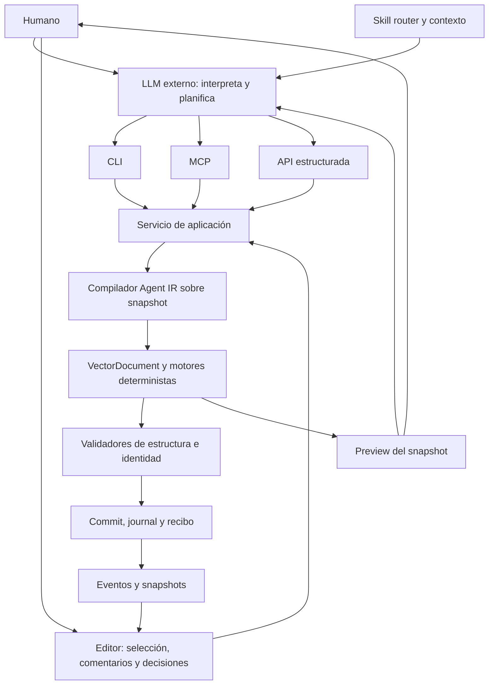

# ADR-001: un servicio determinista compartido para agentes y editor

**Estado:** Propuesto para la siguiente implementación. La separación LLM/MAI fue exigida explícitamente por el usuario.
**Fecha:** 2026-10-04.
**Responsables:** implementador del siguiente corte y revisor de arquitectura.

## Contexto

MAI tiene un editor local, conversor, `VectorDocument`, operaciones reversibles y un servicio HTTP con journal. Hay un borrador de 44 herramientas para agentes. La petición no requiere incorporar un proveedor LLM al producto: Claude/Codex aportan comprensión del lenguaje; MAI aporta geometría, estado, herramientas y pruebas.

## Decisión

Conservar el monolito modular y el SVG editable como fuente de verdad. Usar el servicio de aplicación como única entrada para las mutaciones que participan en una sesión. El editor y los agentes pueden preparar consultas y previews, pero no mantener copias independientes de la lógica de negocio.



La secuencia CLI → MCP no es una cadena obligatoria. Son adaptadores hermanos. MCP puede llamar al servicio HTTP local para compartir la sesión; no invoca el CLI ni reproduce sus flags.

### Responsabilidades

| Capa | Es responsable de | No es responsable de |
|---|---|---|
| LLM externo | Interpretar lenguaje, relacionar feedback con opciones, proponer, evaluar arte y explicar | Inventar operaciones o aprobar identidad mediante números |
| Skills/contexto | Enrutar a playbooks, enseñar el workflow, registrar decisiones duraderas | Ejecutar inferencia ni mutar el asset por leer instrucciones |
| Registro de herramientas | Nombre canónico, esquemas de entrada/salida, disponibilidad, efectos, ejemplos y errores | Lógica geométrica o promesas sin backend |
| Servicio de aplicación | Sesión, snapshots, referencias, planes, jobs, persistencia y políticas | Entender frases artísticas ni inferir autorización desde regex |
| Core | SVG, semántica, identidad, evaluación de frame, geometría y compilación | HTTP, consola, filesystem, credenciales o UI |
| Validadores | Hechos medidos, restricciones y cobertura | Gusto, parecido profesional o aprobación humana |
| Editor | Herramientas de autoría, feedback anclado, opciones, reproducción y estado de jobs | Un segundo intérprete de operaciones con otras reglas |

`feedback.ts` puede conservarse aislado como demo offline explícita; ningún comentario, nota o comando canónico lo llama. El texto se persiste como contexto no ejecutable. Instrucciones contenidas en metadatos SVG o comentarios no conceden permisos al agente.

### Organización incremental

No mover todos los archivos ni crear veinte paquetes ahora:

```text
packages/agent/
  registry.ts         # evoluciona al catálogo con schemas y availability
  address.ts          # referencias y scope, sin semántica inferida por texto libre
  service.ts          # fachada que se divide por casos de uso cuando sea necesario
  plan.ts             # NUEVO: Agent IR, preparación y compilación
  contracts/          # NUEVO: fuente canónica de schemas
packages/server/
  server.ts           # HTTP y WS; delega al servicio
  transactions.ts     # NUEVO: extracción gradual de cola/journal/snapshots
  choices.ts          # candidatos, versiones y procedencia
  comments.ts         # contexto humano anclado
  render.ts           # adapter de render y artefactos
packages/core/        # geometría, autoría, validadores y frame evaluator existentes
packages/cli/        # compatibilidad de comandos + parsing del catálogo
packages/mcp/        # transporte/protocolo, sin dominio
apps/editor/         # consumidor del mismo servicio y evaluador puro
```

Los nombres NUEVO no son APIs disponibles. Primero extraer fronteras con pruebas del comportamiento anterior, después separar módulos grandes por responsabilidad. No introducir un package manager o monorepo nuevo para hacer esta separación.

### Tres representaciones distintas

1. **ProjectDocument:** SVG + metadatos versionados. Fuente persistente de geometría, rigs, semántica y animación.
2. **SceneView:** vista semántica compacta, paginada y vinculada a snapshot. Se lee; no se usa como formato de guardado. `buildIR` actual pertenece aquí.
3. **AgentPlan:** instrucciones tipadas, referencias, restricciones y políticas. Se compila; no contiene el SVG completo ni `d` de miles de paths.

El nombre IR se reserva para `AgentPlan`. `Operation[]` sigue siendo el lenguaje de ejecución de bajo nivel y una salida interna del compilador. La vía básica puede seguir expuesta para edición avanzada, sometida a las mismas garantías.

### Migración de documentos

`Project.version` sigue siendo 1 en el checkout, aunque se añadieron campos de autoría. Separar versión de documento, protocolo Agent IR y revisión de capabilities. Al introducir IDs persistentes, baselines y nuevos invariantes, escribir un migrador explícito v1 → siguiente versión, con backup/roundtrip de fixtures. Documentos antiguos sin semántica se abren como no etiquetados, nunca con anatomía inventada ni baseline aprobado automáticamente.

Un lector antiguo no debe guardar silenciosamente un documento con features nuevas que no entiende. Anunciar `requiredFeatures`, rechazar versiones incompatibles o abrir en modo de lectura; comprobar que se conservan IDs, referencias, máscaras, metadatos y reproducción. El perfil editable sigue conservando autoría; distribución no promete reconstruir el rig.

### Registro y schemas

Adoptar JSON Schema versionado como contrato público. Derivar tipos, validación de entrada/salida, flags CLI y descriptores MCP de una única fuente. Elegir y fijar una biblioteca de validación estándar al implementar; esta revisión no instala ninguna. El esquema parcial hecho a mano no crece hasta ser un segundo JSON Schema.

Cada herramienta anuncia `availability` (`stable`, `experimental`, `unavailable`), requisitos de escena/runtime, compatibilidad, efectos precisos y límites. Una función en el registro no basta para `stable`: necesita pruebas a través del transporte, error/rollback y evidencia visual cuando corresponda.

No expresar reversibilidad y lectura con un único booleano: distinguir escritura de documento, tablero, comentarios y artefactos. Los annotations MCP reflejan esos efectos; liberar protección no se marca inocuo por defecto.

### MCP

Preferir el SDK oficial TypeScript en una versión estable fijada al implementar y revisar su licencia concreta. La ausencia actual de SDK no justifica mantener un protocolo parcial como contrato profesional. Mantener stdio como primer transporte; no añadir un servicio público ni autenticación cloud.

El adaptador debe comprobar inicialización, versión negociada, estructura JSON-RPC, errores de protocolo frente a dominio, salida `structuredContent`, cancelación y cierre limpio. Las imágenes se sirven como artefactos vinculados a snapshot con un presupuesto; ningún resultado debe embeber seis previews enormes sin límite.

Si se mantiene temporalmente el adaptador manual, queda `experimental` y pasa la misma suite de interoperabilidad. El producto funciona por CLI/API mientras se cierra MCP.

### Skills y contexto

Mantener inicialmente `.agents/skills/` como fuente de las skills que ya funcionan. Un router pequeño carga solo el playbook requerido; `capabilities` es la autoridad de operaciones disponibles.

| Intención | Playbooks |
|---|---|
| Tristeza, cansancio, mezcla facial | expresión + identidad + decisiones |
| Animar humo que existe | semántica + fluidos + identidad + movimiento |
| Mejorar geometría o convertir | vectorización/separación + comparación |
| Optimizar o entregar | presupuestos + validación perceptual + exportación |
| Algo se ve mal | preservación/refinamiento + reproducción del fallo |

PRODUCT/VECTOR/MOTION conservan decisiones humanas. Las asignaciones semánticas confirmadas y baselines viven en el asset; no en un prompt global. Los playbooks describen operaciones verificadas, sin anunciar comandos futuros. Si luego se necesitan formatos distintos por proveedor, generar adaptadores desde una fuente común como patrón, sin copiar reglas de frontend de Impeccable.

Una mejora de skill necesita caso real, propuesta, prueba de comportamiento externo y comparación; no se modifica automáticamente porque una métrica pasó. El arnés verifica trazas de herramientas, no frases específicas que el LLM debe pronunciar.

### Extensión futura

Reservar manifiestos de extensión con ID/version, tipo (converter/effect/exporter/validator/tool/panel), schemas, compatibilidad y coste. No construir todavía un marketplace ni ejecutar plugins descargados. Un plugin de tool compila al mismo servicio y no escribe directamente el DOM o el journal. Exporters y validators declaran qué features comprenden; desconocido se rechaza o se conserva de forma explícita, nunca se descarta.

## Opciones consideradas

| Opción | Complejidad | Beneficio | Coste/riesgo |
|---|---|---|---|
| Continuar handlers independientes por transporte | Baja hoy | Entrega nominal rápida | Divergencia, bypass de guards, errores diferentes |
| Reescritura modular completa y paquetes nuevos | Alta | Límites nuevos uniformes | Pierde capacidades existentes y retrasa pruebas reales |
| Servicio compartido sobre motor actual **elegida** | Media | Migración comprobable e integración incremental | Convivencia temporal con rutas legacy y adaptadores |

## Consecuencias y acciones

- Se conserva conversión, autoría y compatibilidad existentes.
- Se requiere probar alias y contratos anteriores durante la migración.
- La skill puede orientar a cualquier LLM; no hace falta integrar credenciales de modelos en MAI.
- Completar primero [el corte vertical](../CONTINUATION.md), luego ampliar dominio.
- Referencias verificadas y decisiones que son nuestras: [investigación](../research/AGENT-SURFACE.md).
